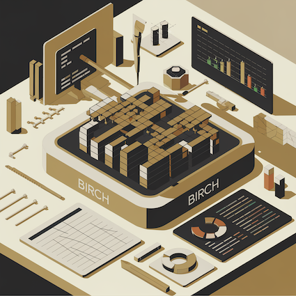

# BIRCH: Benchmarking Infrastructure for Repairing Code Hunks :rocket:

**BIRCH** is a dedicated benchmarking platform designed to address the challenges associated with evaluating the capabilities of foundation models (FMs) in multi-hunk code repair. It incorporates realistic multi-hunk bug instances from the Defects4J dataset and supports both open-source and proprietary LLMs. Additionally, Birch categorizes multi-hunk bugs based on complexity and provides a standardized interface for integrating and evaluating diverse repair techniques. This platform facilitates meaningful comparisons between LLMs and advances the state of research in multi-hunk program repair.



This repository contains three main experiments:

1. **LLM-Only Experiment**  
   All code for the LLM-only study can be found in the  
   [`birch_llm_prompting`](./birch_llm_prompting) folder. **This folder is a *symlink* to the directory *birch* which contains the code.**

2. **Prompt Augmentations**  
   All code for the prompt-augmentation experiments can be found in the  
   [`birch_augmented_prompting`](./birch_augmented_prompting) folder. **This folder is a *symlink* to the directory *redwood* which contains the code.**

3. **Hunk4J**  
   Metadata, raw patch files, and code to extract metadata can be found in the
   [`birch_augmented_prompting`](./Hunk4J) folder.

## Project Structure
```
.
├── Hunk4J
│   ├── README.md
│   ├── code                          # Python scripts for JSON/metadata creation
│   │   └── utils                     # Helper utilities
│   ├── dataset                       # Multi-hunk metadata JSON files
│   ├── javaparser                    # JavaParser-based AST context extractor
│   │   └── method-line-extractor
│   └── patches                       # Raw `.patch` files for bugs
│
├── birch
│   ├── README.md                     # LLM-only repair workflow instructions
│   ├── llm                           # LLM API wrappers and model definitions
│   ├── prompt_configurations         # Prompt templates (e.g., `prompts.toml`)
│   ├── prompts                       # Python prompt generators
│   ├── utils                         # Defects4J and LLM helper utilities
│   └── scripts …                     # Scripts for checkout, repair, validation, and result summarization
│
├── redwood
│   ├── README.md                     # Augmented-technique workflow instructions
│   ├── algorithms                    # Similar-example retrieval, AST/embedding algorithms, etc.
│   ├── hunk4j_statistics             # Scripts & CSVs for multi-hunk descriptive statistics
│   ├── hunk_divergence               # Divergence computation & analysis (Python, R, plots, CSVs)
│   ├── proximity_class               # Spatial-proximity classification tools & plots
│   ├── prompt_configurations         # TOML configs for feedback/retrieval prompts
│   ├── prompts                       # Python modules for compiler-error & similar-result prompts
│   ├── results                       # Results for all experiments with `passed_bugs.json` and summaries
│   ├── solved_bugs_statistics        # CSV reports of which bugs each LLM solved (per scope)
│   └── utils                         # Feedback-loop and general utilities
│
├── birch-llm-prompting -> birch # symlink (LLM-only workflow)
├── birch-augmented-prompting -> redwood # symlink (augmented workflow)
|
├── images                            # Repository-wide image assets (e.g., birch-image.png)
└── README.md                         # (this file)
```
