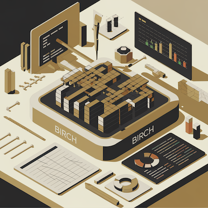

# BIRCH: Benchmarking Infrastructure for Repairing Code Hunks :rocket:

**BIRCH** is a dedicated benchmarking platform designed to address the challenges associated with evaluating the capabilities of foundation models (FMs) in multi-hunk code repair. It incorporates realistic multi-hunk bug instances from the Defects4J dataset and supports both open-source and proprietary LLMs. Additionally, Birch categorizes multi-hunk bugs based on complexity and provides a standardized interface for integrating and evaluating diverse repair techniques. This platform facilitates meaningful comparisons between LLMs and advances the state of research in multi-hunk program repair.

### Environment Setup

Steps to set up the environment to run the framework [here](docs/env_set_up.md)

### Running Our Experiments

Steps to run the bug repair with Defects4J [here](docs/d4j_code_repair.md).

### Defects4J Commands

Commands about Defects4J [here](docs/defects4j_commands.md).